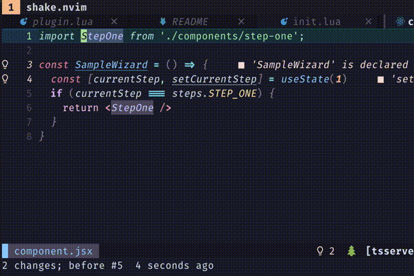

# text-case.nvim

An all in one plugin for converting text case in Neovim

## Features

### Quick conversion

Only 3 keys to convert the current text. 
<sub>Repeatable using `.`</sub>

Smartly guesses the current object using the following strategies:

* Tree Sitter (if available) [WIP]
* Word under cursor
* Ignore word separators


### LSP conversion

Use Language Server Protocol to modify the definition, references and usages of the word under cursor
<sub>Repeatable using `.`</sub>

### Targeted conversion

Converts given objects, it might require more key presses than the quick conversion but allows to control the specific target. 
<sub>Repeatable using `.`</sub>

Supported targets:

* Vim objects: w, iw, aw, e, p, ...
* Selected text in visual mode

### Bulk smart replacement

Converts all forms of a specific text, the replaced text will keep the original text case.

If not specified, it replaces every instance of the text in the current file; But it could be also scoped to the selected block:



### String case conversions

It is also a library of text case conversion methods. Useful for your LUA code.

|      Case     | Example     | Method                     |
|---------------|-------------|----------------------------|
| Upper case    | LOREM IPSUM | textcase.api.to_constant_case |
| Lower case    | lorem ipsum | textcase.api.to_lower_case    |
| Snake case    | lorem_ipsum | textcase.api.to_snake_case    |
| Dash case     | lorem-ipsum | textcase.api.to_dash_case     |
| Constant case | LOREM_IPSUM | textcase.api.to_constant_case |
| Dot case      | lorem.ipsum | textcase.api.to_dot_case      |
| Camel case    | loremIpsum  | textcase.api.to_camel_case    |
| Pascal case   | LoremIpsum  | textcase.api.to_pascal_case   |
| Title case    | Lorem Ipsum | textcase.api.to_title_case    |
| Path case     | lorem/ipsum | textcase.api.to_path_case     |
| Phrase case   | Lorem ipsum | textcase.api.to_phrase_case   |

## Setup

With packer.nvim

```lua
use { "johmsalas/text-case.nvim",
  config = function()
    require('textcase').setup {}
  end
}
```
